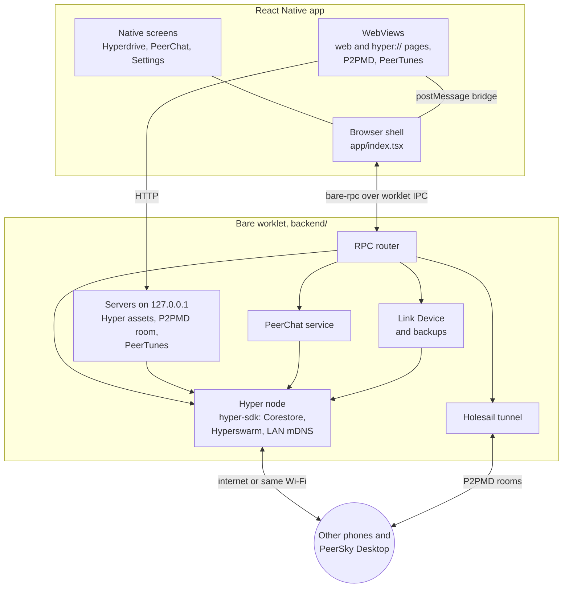

# PeerSky Mobile Documentation

## The browser

- [Browser shell](browser-shell.md): tabs, the address bar, navigation, downloads and how a page is loaded.
- [Content blocking](content-blocking.md): how ads and trackers are blocked on each platform, how the lists update, and what this does not cover.

## Peer-to-peer

- [Hyper protocol](hyper.md): how `hyper://` is fetched, served to the WebView, and kept offline.
- [Holesail runtime](holesail.md): the tunnel the P2PMD notes travel through.
- [Link Device](link-device.md): syncing with another device, and backup files.

## The built-in apps

- [P2PMD](p2pmd.md): collaborative notes and slides.
- [PeerChat](peerchat.md): rooms, direct messages and moderation.
- [PeerChat moderation data](../backend/peerchat/MODERATION_DATA.md): where the word lists and the domain blocklist come from.
- [PeerTunes](peertunes.md): the music player and how a library is shared.

## Working on it

- [Building and running](building.md): what you need, the first iPhone build, and the Android ad blocker setup.
- [Testing guide](testing.md): what the suites cover and how to run them.
- [Releasing](store-release.md): what to do in App Store Connect and the Play Console, and what to tell the reviewers.

## Features

- [x] Browsing
  - Tabs that come back after a restart, and incognito tabs
  - Bookmarks in folders, favourites, history and downloads
  - Page zoom per tab, desktop view, sharing and printing
  - Search with DuckDuckGo (default), DuckDuckGo without AI, Startpage, Ecosia, Kagi or your own engine
  - Home screen widgets and quick actions on iPhone

- [x] Ads and trackers blocked inside the browser engine
  - EasyList and EasyPrivacy, kept up to date
  - A copy ships with the app, so blocking works from the first launch, offline too

- [x] Hypercore protocol
  - `hyper://` pages, with their images, scripts and media
  - Sites built on Hyper can publish from the phone, once you let them
  - Private drives, encrypted so only your own devices can open them
  - Devices on the same Wi-Fi find each other directly, so it keeps working with the internet down

- [x] Built-in apps, each with its own address
  - Hyperdrive, for sharing files (`peersky://p2p/hyperdrive/`)
  - P2PMD, for notes and slides you write together (`peersky://p2p/p2pmd/`)
  - PeerChat, for encrypted rooms and direct messages with no account and no server (`peersky://p2p/peerchat/`)
  - PeerTunes, for music from your own drives (`peersky://p2p/peertunes/`)

- [x] Your data stays on your devices
  - P2P storage is listed per app, so you can see what is there and remove it
  - Link Device moves everything to another phone, device to device, or into a backup file locked with a passphrase
  - It brings private drives, notes, tabs and bookmarks over from PeerSky Desktop

[PRIVACY.md](../PRIVACY.md) says exactly what leaves the phone and what does not.

## How it fits together

PeerSky Mobile is built with [Bare](https://github.com/holepunchto/bare),
[Expo](https://expo.dev) and
[React Native WebView](https://github.com/react-native-webview/react-native-webview).
The app is two programs in one process. The React Native side draws everything
and owns the browser's state. A Bare worklet (`backend/`) runs the
peer-to-peer side: one Hyper node that every feature shares, the PeerChat
service, the Holesail tunnel, and small HTTP servers that only listen on
`127.0.0.1`. The two talk over `bare-rpc`, with the command IDs in
`backend/rpc/commands.mjs`.

Ads and trackers are blocked inside the WebViews, natively, before a request
leaves the phone. Nothing in the worklet sees ordinary web traffic.
