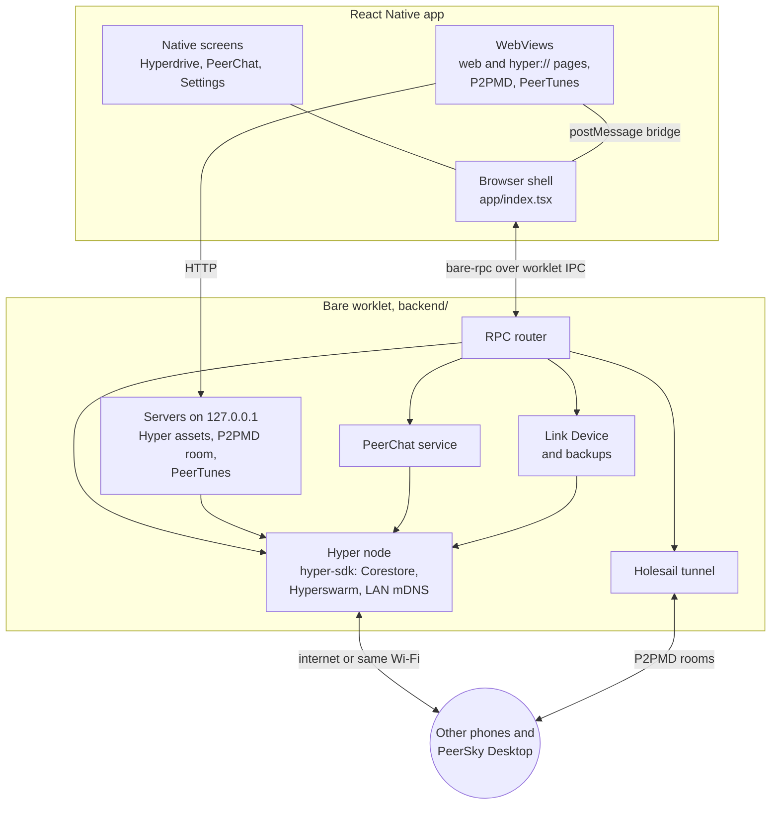

# PeerSky Mobile Documentation

## The browser

- [Browser shell](browser-shell.md): tabs, the address bar, navigation, downloads and how a page is loaded.
- [Content blocking](content-blocking.md): how ads and trackers are blocked on each platform, how the lists update, and what this does not cover.

## Peer-to-peer

- [Hyper protocol](hyper.md): how `hyper://` is fetched, served to the WebView, and kept offline.
- [Holesail runtime](holesail.md): the tunnel the P2PMD notes travel through.
- [Link Device](link-device.md): syncing with another device, and backup files.

## The built-in apps

- [P2PMD](p2pmd.md): collaborative notes and slides.
- [PeerChat](peerchat.md): rooms, direct messages and moderation.
- [PeerChat moderation data](../backend/peerchat/MODERATION_DATA.md): where the word lists and the domain blocklist come from.
- [PeerTunes](peertunes.md): the music player and how a library is shared.

## Working on it

- [Building and running](building.md): what you need, the first iPhone build, and the Android ad blocker setup.
- [Testing guide](testing.md): what the suites cover and how to run them.
- [Releasing](store-release.md): what to do in App Store Connect and the Play Console, and what to tell the reviewers.

## Features

- [x] Browsing:

  - [x] Back, forward and reload, from the bar at the bottom
    - Swipe in from the left edge to go back and from the right edge to go forward
    - Pull down at the top of a page to reload it
  - [x] Address bar at the top or the bottom, showing the site or the full address
    - A line along it fills as a page loads
    - Suggestions from your history, the site first and the most used first
    - Search suggestions from your search engine as you type, with an arrow to keep typing from one, never in incognito tabs or for addresses
    - A button after reload that you choose: Share (default), Add Bookmark, Add Favourite, Reader View, Send to Your Devices, Zoom, Desktop View, Print, New Tab or none
  - [x] Search engine
    - DuckDuckGo (default)
    - DuckDuckGo without AI
    - Startpage
    - Ecosia
    - Kagi
    - Your own engine, from a search address
    - The other engines a tap away, for one search
  - [x] Tabs
    - Tabs come back after a restart
    - Recently closed tabs, and Undo after closing one
    - Tabs not opened for two weeks fold into an Inactive tabs group
    - Pick several tabs to copy their links, share them or close them
    - Press and hold a tab to drag it to another place
    - Five live pages at once, the rest kept asleep until opened
  - [x] Incognito tabs
    - No history, no saved tab, no tab preview on disk and no cache
    - Cookies and site data kept apart from normal tabs and gone when the last incognito tab closes
    - Links opened from one stay incognito
    - Sites cannot publish to your drives from one
  - [x] Bookmarks, in folders one level deep, with Undo after removing one
  - [x] Favourites on the home screen
  - [x] History, and clearing it
  - [x] Downloads, with progress, pause and resume
    - A download a page starts asks first
  - [x] Reader View: a page's article on its own, in one column, at a text size you pick, with nothing from the page running
  - [x] Page zoom per tab, website text size, and pinch zoom on sites that block it
  - [x] Desktop view, printing and sharing a page
  - [x] Send to Your Devices: puts the page in your PeerChat chat with yourself, for your desktop or another phone
  - [x] Press and hold a link, a picture or a video: open it in a new or background tab, preview it, download it, copy or share it
  - [x] Burn Tabs and Data: closes every tab and clears history and cached data in one press
  - [x] Dark websites, for sites with no dark theme of their own
  - [x] Sites ask before they get the camera, the microphone or the location, with their own address in the question
  - [x] Android
    - PeerSky as the default browser
    - PeerSky in the share sheet: a link shared from another app opens in it
    - Add to Home Screen, which puts a page on the home screen with its own icon
  - [x] iPhone
    - Home screen widgets: PeerSky, with search, the P2P apps and your bookmarks, and PeerTunes, with what is playing
    - Quick actions on the app icon: Paste and Go, New Tab, New Incognito Tab and App Icon

- [x] Customization (Settings > Appearance):

  - [x] Theme: system default, light or dark
  - [x] App icon in six colours
  - [x] The button in the middle of the bottom bar: Burn Tabs and Data (default), Add Bookmark, Add Favourite, Bookmarks, Downloads, History, Home, New Incognito Tab, New Tab, Settings, Share or Zoom
  - [x] The button after reload in the address bar, as above

- [x] Ads and trackers blocked inside the browser engine:

  - [x] EasyList and EasyPrivacy, kept up to date
  - [x] YouTube ads blocked, and a switch to turn that off
  - [x] A copy of the lists ships with the app, so blocking works from the first launch, offline too
  - [x] A link to test the browser's protection

- [x] Hypercore protocol:

  - [x] `hyper://` pages, with their images, scripts and media
  - [x] `hyper://` sites with domain names, such as `hyper://agregore.mauve.moe/`
  - [x] Pages on `hyper://` and `https://` can use `fetch()` and `XMLHttpRequest` with `hyper://`, as on desktop
    - Publishing from a site asks first, and the answer can be changed in Settings > Permissions
    - A page's drives are its own, and it cannot read your private drives
  - [x] `peersky://p2p` lists the `hyper://` sites this phone has opened, with a search, so they open offline too
  - [x] Devices on the same Wi-Fi find each other directly, so it keeps working with the internet down

- [x] Hyperdrive (`peersky://p2p/hyperdrive/`):

  - [x] Upload files or a folder, as:
    - Public: anyone with the link can open it
    - Private: encrypted, so only your own devices can open it
    - This device only: never leaves the phone
  - [x] Copy or share the link of what you uploaded
  - [x] Fetch a `hyper://` address, pasted or scanned from a QR code
  - [x] Browse a drive's folders and open its files
  - [x] Keep a folder offline, with pause, resume and progress, and an option to download only on Wi-Fi
  - [x] Recent, with what you uploaded and fetched
  - [x] From your devices: private files from your other devices show up here on their own, and this phone's show up there, with a copy kept on your desktop

- [x] P2PMD (`peersky://p2p/p2pmd/`):

  - [x] Notes you write together, live, over a Holesail tunnel
  - [x] Markdown preview, slides, math with KaTeX, and a two-column research paper preview
  - [x] Templates for a research paper or a technical document
  - [x] Publish a note to `hyper://`
  - [x] The people in a note, who is editing, who wrote each line, and recent edits
  - [x] Up to 100 people in a note
  - [x] Recent notes, with a copy kept of each note the phone hosts, so it opens again with nobody else online

- [x] PeerChat (`peersky://p2p/peerchat/`):

  - [x] Group rooms and direct messages, with no account and no server
  - [x] Every message is encrypted and signed by whoever wrote it, and passed on from device to device
  - [x] Rooms and direct messages made on 0.1.2 or later change their key every hour
  - [x] Replies, reactions, mentions and search
  - [x] Files and pictures, encrypted with the room, and link previews
  - [x] Message requests to accept or decline
  - [x] Invite links and QR codes, and invites sent through any app
  - [x] A profile with a name, a bio, a picture and a short ID
  - [x] Pinned and muted chats, unread counts and mention bubbles
  - [x] Online and away dots
  - [x] Notifications and sounds
  - [x] Moderation
    - Whoever made a room can remove anyone from it, and the removal reaches everyone in the room
    - Block or report anyone, from a message or their profile
    - Groups hold back threats, slurs and adult links, and refuse explicit pictures before they are sent
  - [x] Works on the same Wi-Fi with no internet
  - [x] The same profile and rooms on your phone and desktops, each device named after you
  - [x] A chat per browser tab

- [x] PeerTunes (`peersky://p2p/peertunes/`):

  - [x] The click-wheel music player, for music from `hyper://` drives, `https://` links and files on the phone
  - [x] Plays in the background, with the track, artist and artwork on the lock screen
  - [x] Shows when the sound goes to Bluetooth
  - [x] Plays from drives on the same Wi-Fi with no internet

- [x] Link Device and backups (Settings > Link Device):

  - [x] My devices: your desktops and phones, shown as Desktop or Phone, online or when last seen
  - [x] Move everything to a new phone, device to device
  - [x] Bring private drives, notes, chats, tabs and bookmarks over from PeerSky Desktop, and send tabs, bookmarks, notes and chats to it
  - [x] A backup file locked with a passphrase, to keep wherever you like
  - [x] Remove your data from a phone you are handing on
  - [x] PeerSky data stays out of iCloud, Google and computer backups, which would copy its keys to another phone

- [x] Your data stays on your devices:

  - [x] Settings > P2P Data
    - P2P sites you opened, and data per app, to see what is there and remove it
    - Offline folders, to pause, resume or remove
    - The Hyper archive: everything you published, with a search
    - Downloaded cache, and all P2P data
  - [x] Settings > Data Clearing
    - Cookies and site data, listed site by site, to remove one or all
    - Cached website data, or tabs and cached data together
  - [x] Settings > Permissions: camera, microphone and location per site, notifications, local network, links to other apps, and publishing from sites
  - [x] Nearby devices, from the home screen: the devices found on the same Wi-Fi, and what to change when none show up
  - [x] Nothing collected: no analytics, no accounts, and QR codes read on the phone

[PRIVACY.md](../PRIVACY.md) says exactly what leaves the phone and what does not.

## How it fits together

PeerSky Mobile is built with [Bare](https://github.com/holepunchto/bare),
[Expo](https://expo.dev) and
[React Native WebView](https://github.com/react-native-webview/react-native-webview).
The app is two programs in one process. The React Native side draws everything
and owns the browser's state. A Bare worklet (`backend/`) runs the
peer-to-peer side: one Hyper node that every feature shares, the PeerChat
service, the Holesail tunnel, and small HTTP servers that only listen on
`127.0.0.1`. The two talk over `bare-rpc`, with the command IDs in
`backend/rpc/commands.mjs`.

Ads and trackers are blocked inside the WebViews, natively, before a request
leaves the phone. Nothing in the worklet sees ordinary web traffic.
