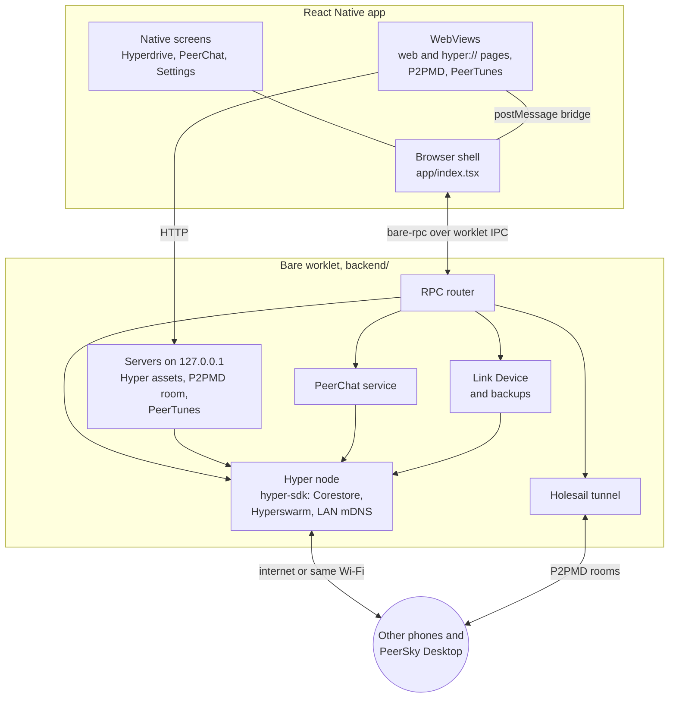

# PeerSky Mobile docs

Written for whoever picks this up next, including us in six months.

## How it fits together

The app is two programs in one process. The React Native side draws everything
and owns the browser's state. A Bare worklet (`backend/`) runs the
peer-to-peer side: one Hyper node that every feature shares, the PeerChat
service, the Holesail tunnel, and small HTTP servers that only listen on
`127.0.0.1`. The two talk over `bare-rpc`, with the command IDs in
`backend/rpc/commands.mjs`.

Ads and trackers are blocked inside the WebViews, natively, before a request
leaves the phone. Nothing in the worklet sees ordinary web traffic.

## The browser

- [Browser shell](browser-shell.md): tabs, the address bar, navigation, downloads and how a page is loaded.
- [Content blocking](content-blocking.md): how ads and trackers are blocked on each platform, how the lists update, and what this does not cover.

## Peer-to-peer

- [Hyper protocol](hyper.md): how `hyper://` is fetched, served to the WebView, and kept offline.
- [Holesail runtime](holesail.md): the tunnel the P2PMD notes travel through.
- [Link Device](link-device.md): syncing with another device, and backup files.

## The built-in apps

- [P2PMD](p2pmd.md): collaborative notes and slides.
- [PeerChat](peerchat.md): rooms, direct messages and moderation.
- [PeerChat moderation data](../backend/peerchat/MODERATION_DATA.md): where the word lists and the domain blocklist come from.
- [PeerTunes](peertunes.md): the music player and how a library is shared.

## Working on it

- [Testing guide](testing.md): what the suites cover and how to run them.
- [Releasing](store-release.md): what to do in App Store Connect and the Play Console, and what to tell the reviewers.
