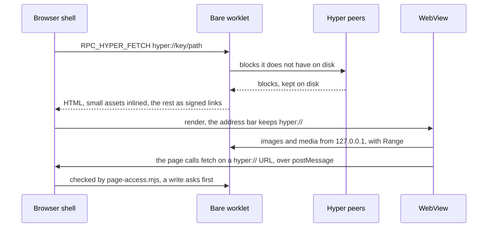

# Browser Shell

PeerSky Mobile combines a React Native browser interface, platform WebViews,
and a Bare runtime. The browser shell owns navigation and browser state while
the Bare runtime provides protocol-specific services such as `hyper://`.

## URL routing

The address bar accepts URLs and search terms. `app/browser-shell.mjs`
normalizes the input and routes it through one of three paths:

| URL | Handler |
| --- | --- |
| `http://` and `https://` | Loaded directly by the platform WebView |
| `hyper://` | Fetched by the Bare runtime through `hypercore-fetch`, then rendered by a WebView |
| `peersky://` | Resolved to a local app registered in `app/internal-apps-registry.mjs` |

Inputs without a URL scheme are treated as either a web address or a search.
The default search engine is DuckDuckGo; a custom HTTPS search template can be
configured in Settings.

Only supported schemes reach the browser renderer. External app schemes are
handled separately by the permission flow, and unsupported schemes are
blocked.

## Browser state

`app/index.tsx` coordinates the active browser state and renders the selected
source. Pure state transitions are kept outside the component so they can be
tested independently:

- `app/browser-shell.mjs` manages address normalization and per-tab navigation.
- `app/browser-tabs.mjs` manages tabs, live WebView allocation, page zoom, and
  serialized tab state.
- `app/browser-session.mjs` restores or resets a saved browsing session.
- `app/history/` stores bounded browsing history and provides address-bar
  suggestions.
- `app/bookmarks/` validates and stores bookmarks and their favicons.
- `app/tabs/` captures and stores bounded tab previews.
- `app/downloads/` tracks downloads and connects the browser to the native
  download implementation. A download a page starts waits for the person to
  say yes, and a downloaded APK opens in the system's Downloads, since PeerSky
  does not hold the permission to install apps.

Tab history stores restorable URLs instead of retaining generated Hyper or
error HTML. On restoration, those URLs are fetched again. At most five browser
WebViews remain live at once; background tabs outside that set retain their
serializable state rather than an active renderer.

## HTTP and HTTPS

Web pages use `react-native-webview`. Navigation callbacks synchronize the
current URL, title, history entry, back/forward state, favicon, and tab preview.
The Android system Back action first consumes WebView or tab history before it
can leave the app.

The native WebView component is exposed through
`app/downloads/PeerSkyWebView.ts`. It falls back to the stock WebView when the
generated native view is unavailable. Native integration supplies downloads,
media context actions, permissions, and request-level content blocking.

## Hyper

The React Native layer cannot fetch `hyper://` directly. Hyper navigation uses
this path:

1. `app/index.tsx` sends `RPC_HYPER_FETCH` to the Bare worklet.
2. `backend/rpc/router.mjs` dispatches the request to
   `backend/hyper/fetch.mjs`.
3. `hypercore-fetch` reads from the Hyper SDK using a read-only fetch instance.
4. HTML responses pass through the bounded asset rewriting logic in
   `backend/hyper/assets.mjs`.
5. The resulting HTML is rendered by a WebView with its Hyper URL retained as
   the visible browser address.



Small assets may be inlined within configured count, size, and concurrency
budgets. Streamable or larger media is served through the authenticated
loopback server in `backend/hyper/asset-server.mjs`. The generated asset URLs
carry an unguessable token, and the server accepts only validated Hyper asset
requests. The loopback route avoids buffering complete videos in JavaScript
memory and supports range requests used by media playback.

Navigation sequence checks prevent an older, slower Hyper request from
overwriting a newer page. Hyper history entries are restored by URL rather
than by persisting remote HTML.

## Internal apps

`app/internal-apps-registry.mjs` is the canonical registry for local
`peersky://` routes. `app/internal-apps.ts` maps those route identifiers to the
React Native runtime views. Internal apps share the browser tab and navigation
model but do not load arbitrary remote HTML as an app screen.

The current internal routes include P2PMD, Hyperdrive, PeerTunes, and Holesail
diagnostics. Protocol details are documented separately in [P2PMD](p2pmd.md),
[PeerTunes](peertunes.md), [Hyper](hyper.md), and [Holesail](holesail.md).

## Settings and privacy

Browser preferences are stored and validated by `app/settings/`. They cover
startup behavior, appearance, accessibility, search, permissions, data
clearing, and privacy controls.

Network-level ad and tracker blocking is initialized before restored WebViews
are mounted. Android evaluates requests in the custom WebView client. iOS uses
compiled WebKit content rules. See [Ads and tracker blocking](content-blocking.md)
for setup, update behavior, and platform limitations.

## Incognito tabs

**New Incognito Tab** in the menu opens a tab that keeps nothing: no history
entries, no tab preview on disk, no HTTP cache, and it is never written into
the saved session, so it is gone when the app closes. Links and popups opened
from it stay incognito, and the address bar and tab list mark it.

Cookies and site storage are kept apart from normal tabs. The app names a
session for each run of incognito tabs (`incognitoSession` in
`PeerSkyWebViewManager`), kept while any of them is open and replaced once the
last one closes. On iOS a session is one WebKit data store that is never
written to disk. Android WebViews all share one cookie jar, and
react-native-webview's own `incognito` prop empties it, signing people out of
every normal tab, so there a session is a WebView profile of its own, and the
profiles of earlier sessions are deleted. Going back builds a new WebView, and
the session is what lets it keep the tab's cookies. Profiles need Android
System WebView 123 or later; on an older one the menu says to update it rather
than opening a tab that would share cookies.

A `hyper://` site cannot publish from an incognito tab: its answer would be
saved in Permissions and its drives would stay on the phone. Drives opened in
one still go through the app's Hyper node, which keeps their blocks like any
other drive's until P2P data is cleared.

## Native generation

Native browser code is generated during Expo prebuild by the tracked config
plugins and templates under `plugins/`. Edit those sources instead of editing
generated files under `android/` or `ios/`, because a later prebuild can replace
generated changes.

Backend changes also require regenerating `app/app.bundle.mjs`:

```sh
npm run bundle:bare
```

## Tests

Protocol-independent browser behavior is covered under `test/platform/`.
Hyper and other protocol behavior is covered under `test/protocol/`, with live
integration coverage under `test/integration/` where applicable.

Run the standard checks with:

```sh
npm run lint
npx tsc --noEmit
npm test
```

The test suite covers pure navigation and persistence helpers, generated native
configuration, Hyper fetching and assets, the loopback asset server, and
protocol runtime behavior. Device smoke testing is still required for WebView
rendering, system permissions, downloads, media playback, sharing, rotation,
and native content blocking.
