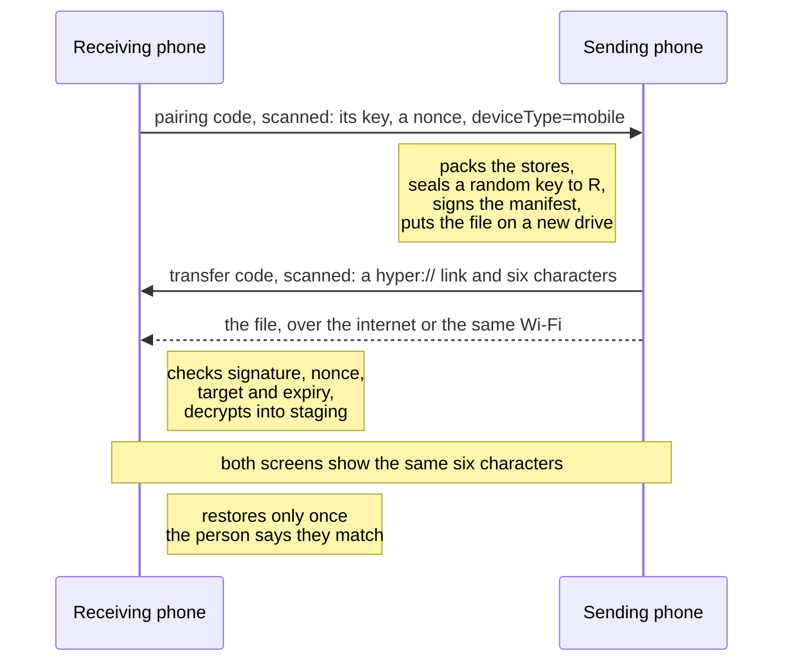

# Link Device: sync and backup

Settings > Link Device moves everything PeerSky keeps on a phone to another device, and keeps a backup file for when a phone is lost. Nothing goes through a server: one device hands the data straight to the other, encrypted so only that device can open it.

It is the only way PeerSky data moves. The app keeps it out of iCloud, computer and Google backups and out of Android's phone-to-phone copy (`plugins/with-no-device-backup.js`), which would restore this phone's keys onto another one that then writes to the same feeds.

## The screen

- **This device**, then **Sync with another device**: one sheet for both directions. *Receive here* shows this phone's pairing code; *Send from here* is for scanning the other device's. The scan decides what happens either way: a pairing code (`peersky-identity:`) means "send this phone there", and a `hyper://` code is a transfer another device has ready for this one. A desktop's pairing code sends the tabs and bookmarks to that desktop.
- **Save a backup file** and **Restore from a backup file**.
- **Get the desktop browser**.
- **Remove my data from this phone**, for handing a phone on or finishing a move.

## What moves

| Data | Backup file, or phone to phone | Desktop to phone | Phone to desktop |
|---|---|---|---|
| Tabs | Replaced | Added to the tabs already open | Opened asleep in a group called Phone |
| Bookmarks and favourites | Replaced | Added | Added to the desktop's bookmarks |
| History and settings | Replaced | Not sent | Not sent |
| PeerChat profile, rooms and messages | Replaced | The profile and rooms, as `name@mobile` | The profile and rooms, as `name@desktop` |
| P2PMD notes, name and recent notes | Replaced | The five recent notes, added, and the name if none is set | The same, to the desktop |
| Drives: public, private and this-device-only | Replaced | Private drives adopted read-only | The private drive, readable there and read-only |
| The key for private files | Replaced | Sent, and used for the phone's private uploads | Not sent: the desktop made it |

Never copied: `device-key.json` and `pairing-nonce.json` (this device's own keys), `welcome-seen`, `p2pmd-welcome-seen` and `hyperdrive-welcome-seen`, notification settings tied to this phone's permission, downloads, and the content blocking lists, which rebuild on their own.

A phone backup restored somewhere, or a phone-to-phone transfer, carries the Hyper stores themselves (`hyper-sdk`, `hyper-sdk-private`, `hyper-sdk-synced-private`, `hyper-sdk-adopted`). That is what keeps the PeerChat identity, every chat, and every drive writable on the new phone: it moved, it was not copied read-only.

## One phone per identity

Two phones holding the same identity write the same chat feeds and split them. After moving to a new phone, remove your data from the old one. The sheet says so once a send is done.

## P2PMD notes on your phone and desktops

A desktop whose pairing code says `notes=1` gets this phone's five most recent notes and its P2PMD name, and a desktop sends its own the same way: this phone's code says `notes=1` too (`backend/p2pmd/notes-transfer.mjs`, the same rules as `notes-transfer.js` in P2PMD on the desktop).

- A note this phone hosts goes with its text, from its copy in `hyper-sdk/p2pmd-rooms`. A note it only joined goes as one to join.
- Only a private note (`hs://s000...`) can be hosted from a copy: its key is what the host's keys are made from. This phone makes every note private. A desktop makes them public unless Private is ticked, and a public note's address is the host's public key, so only that desktop can host it. It arrives here as a note to join while the desktop has it open.
- Only the key, the name and the text travel. A drive address, a port or a hosting seed belongs to the device that made it: a copied desktop profile that kept a drive address sent every P2PMD write to a drive the new machine could not write to (P2PMD #18). None of them go, and the receiving side drops any field it does not know.
- Nothing already there is replaced. A note already on the receiving device keeps its own copy, and a name already set stays.
- A desktop's notes arrive in `p2pmd-incoming.json`. Once the backend is up, the app asks it to keep the text of each hosted note as this phone's copy, adds the notes to Recent notes, and removes the file only after the list is saved. The phone keeps up to ten copies, twice the five on the list, so five arriving cannot push out the copies of its own five.

A note that went with its text is on both devices, and both open it the same way. Reopen looks for it on the other device first (`probe` on the join): if that device has it open, both edit the same note live. If nobody answers within a few seconds, the phone hosts its own copy. Without a copy, because the text of the notes together did not fit in 3 MB, it says so rather than putting up an empty note.

## PeerChat on your phone and desktops

A person's PeerChat goes with the transfers between a phone and a desktop, and each device stays its own member of a room: its own network key, and a label after the name so everyone can tell which device a message came from. The device the name was made on shows the name alone. The phone is `ada@mobile`, and desktops are `ada@desktop1`, `ada@desktop2`, or, when the name was made on the phone, `ada@desktop` first and then `ada@desktop2`. The label is fixed: it cannot be edited and does not change with the name. There is one phone; a new phone takes this one's place, by phone to phone and then *Remove my data from this phone* on the old one.

What goes (`backend/peerchat/device-link.mjs`, the same rules as `lib/device-link.js` in PeerChat on the desktop):

- The profile: name, bio, picture, and when they were last changed.
- Every room with its key, and when the person joined it, so peers send the new device the history since then. Direct messages too, once the other person has accepted them. A phone keeps up to 50 rooms.
- The label the other device takes, and a link: 32 random bytes the person's devices share. It only travels inside the sealed transfers.

A device takes PeerChat only when its pairing code says `chat=1`, which this phone's code does. An older app refuses files it does not know, so it is sent none.

A name, bio or picture changed on one device reaches the others the next time they are in a room together. Every profile a device sends carries a proof: an HMAC-SHA256 with the link key over the name without its label, the bio, the picture's SHA-256, when they were set, the labels it knows and the sending device's network key. A device takes a newer profile only with a proof it can check on that same connection, so nobody else can rename a person's devices or pass a proof on as theirs, and a name one of them holds does not count as taken.

Devices that have proved this to each other also send each other the rooms they are in, with their keys (`link-rooms`): a room joined on one device appears on the others that are online, or the next time they connect. A room left on a device stays left there, and is not taken back from the others until it is joined again. A direct conversation goes along once the other person has accepted it.

## Backup files

A backup is one file, `peersky-backup-YYYY-MM-DD.peersky`, handed to the share sheet so it can go to Files, iCloud Drive, Google Drive, email or another phone. It is locked with a passphrase of at least 12 characters. PeerSky cannot recover a forgotten passphrase.

```
"PEERSKY-BACKUP\n"   15 bytes
format version       1 byte
manifest length      u32 LE, always 16 KiB
manifest             JSON, padded with spaces
payload              secretstream header, then [u32 LE length][ciphertext] frames
```

- The key comes from the passphrase through Argon2id (64 MiB, 3 passes). The manifest carries the salt, the parameters, and a short keyed hash of the key, so a wrong passphrase is told apart from a damaged file.
- The payload is XChaCha20-Poly1305 secretstream: every 64 KiB frame is authenticated, and the last one is marked, so a file cut short is caught instead of half restored.
- Inside the payload is a run of records, `[u32 LE header length][header JSON][file bytes]`, ending with `{ "type": "end" }`. Files stream from disk to disk and are never held in memory whole.

Why not the desktop's zip and AES-GCM: every zip entry needs a CRC32, which the phone would have to compute in JavaScript over gigabytes of Hyper data, and bare-crypto's GCM holds the whole payload in memory, twice. The desktop cannot open a phone backup, and a phone cannot open a desktop backup: each holds the other's own store layout. What a phone sends a desktop is a few hundred kilobytes at most, so that does use the desktop's format (see Phone to desktop).

## Phone to phone

1. The receiving phone shows its pairing code: its encryption key, a nonce, and `deviceType=mobile`. The nonce is kept on disk for 15 minutes so a worklet restart does not change it.
2. The sending phone scans it. It pauses its Hyper stores, packs the same contents as a backup, and seals a random content key to the receiver's key with `crypto_box_seal`. The manifest is signed with the sender's Ed25519 key.
3. The file is put on a drive in the sender's own store, so the receiver finds it the usual ways, over the internet or the local network. The sender shows it as a QR code, with a six character code.
4. The receiver scans that, downloads the file to disk, checks the signature, the nonce, the target key and the expiry, and decrypts it into staging.
5. Both screens show the same six characters: the first three bytes of `sha256(source signing key, target key, nonce)`, which is how the desktop derives it too. Only when the person confirms they match does anything on the phone change.



The sender clears the transfer when its sheet is closed, or 15 minutes after it was made. Each send uses a new drive. Hyperdrive's `purge()` calls a method that does not exist in the hypercore release in use, so the file's blocks are cleared instead; the drive's index is kept, because clearing it leaves a drive that hangs whenever it is opened again. A send cut short by the app being killed leaves a marker, and the next start clears its drive.

## Phone to desktop

On the desktop, Backup & Restore shows a pairing code with `deviceType=desktop`. The phone scans it in *Send from here*, and sends what a desktop can use: the open tabs, the bookmarks and favourites, its private drive with the key to it (see Private files), and PeerChat (see PeerChat on your phone and desktops) when the desktop's code has `chat=1`. Messages, notes, history and the stores stay on the phone. None of it needs the stores closed.

It goes in the desktop's own transfer format (`backend/backup/desktop-sync.mjs`), so the desktop checks it with the code it already has for transfers:

1. An inner zip holds `phone-tabs.json`, `phone-bookmarks.json`, `phone-private-drives.json` when there is a drive to share, `phone-peerchat.json` for PeerChat, `phone-p2pmd.json` for P2PMD notes when the desktop's code says `notes=1`, and a `manifest.json` that says `"source": "mobile"` and lists each file's SHA-256.
2. That zip is encrypted with AES-256-GCM under a random key sealed to the desktop with `crypto_box_seal`. It is small, so bare-crypto's GCM in one piece is fine here. The zips are stored, not compressed (`backend/backup/zip-writer.mjs`).
3. The manifest is signed with the phone's Ed25519 key over the same fields the desktop signs, with `targetDeviceType: 'desktop'`.
4. The file is put on a drive at `/backup.zip`, so the drive's bare address works on the desktop too. The phone shows it as a QR code with **Copy link**, and the six characters.

On the desktop, *Restore from the network* takes the link. It downloads it, checks that it was made for a code this desktop showed in the last hour, checks the signature, decrypts it, and shows the six characters. Only once the person confirms does anything change: the bookmarks are added after the desktop's own, the tabs open asleep in a collapsed group called Phone, and the phone's private drive is added to the desktop's private drives, read-only, as a drive adopted from another device always is, and PeerChat there takes the phone's name with its own label and joins the phone's rooms. A bookmark or tab the desktop already has is skipped. Nothing else is replaced and nothing restarts. The code is used up, and the page shows a fresh one.

A desktop that is still in its first-run screen takes the same link there, under *Restore a backup, or bring tabs from your phone*, and opens its first window with the phone's tabs beside Home.

## Desktop to phone

The desktop scans the phone's code and uploads a transfer sealed to the phone (`identity-payload.bin`, AES-256-GCM, format version 1). It sends only what a phone keeps: `tabs.json`, `bookmarks.json`, `peersky-identity.json`, and with private uploads included, which is the default, the private drives and the key for private files. The key goes even when the desktop has no private drives yet, because the phone's own private uploads use it. The phone downloads it to disk and decrypts it as AES-256-CTR, starting from the counter GCM uses for its first block, which streams. The GCM tag is not what vouches for the bytes: the SHA-256 of the encrypted payload is in the signed manifest, and the result is only kept if it matches.

What the phone keeps:

- `peersky-identity.json`.
- The private drives: `privateHyperdrives.json`, `private-drive-key.json` and `hyper-private/`, adopted read-only into `hyper-sdk-adopted`. The copy of `hyper-private/` is removed once adopted.
- `tabs.json`, turned into `incoming-tabs.json`: a plain list the app adds to the open tabs on its next start. The desktop keeps tabs keyed by window, which the phone cannot read.
- `bookmarks.json`, the same way, into `incoming-bookmarks.json`.
- `peerchat-incoming.json`, the person's PeerChat. PeerChat takes it on its next start, as `name@mobile`, and deletes it.
- `p2pmd-incoming.json`, the person's recent P2PMD notes, when this phone's code says `notes=1`. The app takes it once the backend is up (see P2PMD notes on your phone and desktops above).

What it skips, from desktops that still send it: the desktop's own `hyper/` store, which nothing on the phone opens and which can run to gigabytes, and `lastOpened.json`, `peersky-chat-rooms.json`, `peersky-ports.json` and the desktop caches. An unknown file fails the restore; `device-key.json` is always refused.

A drive the desktop lists that is the phone's own, sent there earlier, is not adopted: that would make the phone's own drive read-only on the phone.

## Private files

Private uploads are encrypted with the key the desktop sends with its identity, so the desktop can open them too. Until a desktop has sent one, choosing Private in Hyperdrive asks to link the desktop first, with Link Device to go and do it, or This device only to keep the file on the phone.

The phone keeps the desktop's key at the top of Documents (`private-drive-key.json`). Its own private drive gets its key the first time it is opened, from that file when it is there (`getPrivateDriveKey` with `linkedKey` in `backend/hyper/private-keys.mjs`). A key the phone already has is never swapped, since the files under it would stop opening. That does not keep a drive made before linking from the desktop: *Send from here* sends the drive's own key with its address, sealed to the desktop like the rest, and the desktop opens the drive with it. The same goes for a second desktop. The key file travels in backups and phone-to-phone transfers, so a phone restored from this one encrypts for the same desktop.


## Putting a restore in place

- Everything is decrypted into `Documents/.peersky-restore-staging` first. Cancelling the confirmation deletes it.
- A staged restore carries an id, and confirming or cancelling names it, so a dialog that has gone stale can never put a different restore in place.
- On confirm, only the restored top-level entries are swapped in, all or nothing, with the old ones put back if any move fails. Everything else in Documents stays where it is. This used to rename the whole documents folder away and keep a short list, and that folder also holds bookmarks, history, settings and downloads.
- A journal is written before the first move. If the app is killed part way, the next start undoes the swap before any store is opened. Once every entry is in place the old copies are renamed to a trash folder, which marks the restore finished, so a crash while deleting them is not mistaken for a restore to undo.
- Restoring a store also clears what depends on it: the offline list beside it, and the adopted store beside the private one.
- Each restored store gets a fresh `CORESTORE` device file. A copied one refuses to open ("Invalid device file, was moved unsafely"), and with none at all the storage layer takes the folder for an old layout and moves everything it does not recognise into `db/`, including PeerChat's state and the P2PMD snapshots.
- The app switches to a screen asking for a restart before the data is replaced, not after: the screens on show hold the old data, and PeerChat writes its state as it closes. The screen stays until the app is started again. iOS cannot restart an app, and on newer Android `BackHandler.exitApp()` only sends it to the background.

## Keeping it safe while it runs

- One Link Device job runs at a time: packing, sending, receiving, unpacking, restoring or removing. Two unpacks sharing the staging folder once produced a store made of two backups.
- While the stores are packed or replaced they are held shut (`holdHyperStores` in `backend/hyper/runtime.mjs`). PeerChat opens the runtime directly rather than through the maintenance window, and its poll every few seconds used to reopen a store part way through a backup.
- A file that disappears while it is being packed, such as a P2PMD snapshot replaced by a rename, is left out instead of failing the backup. Half-written `*.tmp` files are never packed.
- **Restore from a backup file** opens passphrase backups only. A transfer is only ever opened through Sync with another device, where the six characters are compared.
- Sending needs about twice the data's size free, because the packed file is copied again onto the drive it is sent from, and a transfer is capped at 16 GB.
- A write to the transfer drive that fails, or deflate data in a desktop transfer that is damaged or crafted to expand, fails the step cleanly. An unhandled rejection aborts the whole Bare worklet, and a stream that never drains would hold a runtime operation forever.

## Key files

- `backend/backup/link-device.mjs`: every flow above, called from the router.
- `backend/backup/phone-backup.mjs`: what a backup carries, making backups and transfers, staging a restore.
- `backend/backup/backup-file.mjs`: the file format and the encrypted payload.
- `backend/backup/backup-archive.mjs`: the records inside the payload.
- `backend/backup/desktop-transfer.mjs`: receiving a desktop transfer from disk.
- `backend/backup/desktop-sync.mjs`: what a phone sends a desktop, in the desktop's format; `zip-writer.mjs` writes its zips.
- `backend/backup/zip-file.mjs`: reading a zip from disk, a stream at a time.
- `backend/backup/restore.mjs`: what a desktop transfer keeps, and the swap into Documents.
- `backend/backup/browser-import.mjs`: desktop tabs and bookmarks into lists the phone reads.
- `backend/backup/transfer-publisher.mjs`: putting a transfer on a drive and clearing it.
- `backend/backup/pairing-code.mjs`, `pairing-nonce.mjs`, `device-keys.mjs`, `private-drive-import.mjs`.
- `backend/peerchat/device-link.mjs`: labels, the profile proof and the PeerChat part of a transfer.
- `app/settings/LinkDevice.tsx`: the screen and its sheets; `app/settings/link-device-state.mjs` holds its plain logic.
- `app/hyperdrive/private-upload.mjs`: whether this phone has a desktop's key yet, for the Private choice in Hyperdrive.
- `app/RestartRequiredScreen.tsx`.

## RPC API

| Command | Payload | Response |
|---|---|---|
| `RPC_IDENTITY_GET_KEY` (30) | `{}` | `{ ok, encryptionPublicKey, nonce }` |
| `RPC_IDENTITY_RESTORE_FROM_HYPER` (31) | `{ hyperUrl }` | `{ ok, restoreId, source: 'desktop' \| 'phone', sas, restoredFiles, contents }` |
| `RPC_IDENTITY_CONFIRM_RESTORE` (32) | `{ restoreId }` | `{ ok, requiresRestart: true, source, privateDriveRestored, ... }` |
| `RPC_BACKUP_ESTIMATE` (33) | `{}` | `{ ok, bytes, contents }` |
| `RPC_BACKUP_CREATE` (34) | `{ outPath, passphrase, peerskyVersion, platform }` | `{ ok, path, bytes, contents }` |
| `RPC_BACKUP_INSPECT` (35) | `{ path }` | `{ ok, kind, createdAt, platform, contents, sizeBytes, needsPassphrase }` |
| `RPC_BACKUP_RESTORE_FILE` (36) | `{ path, passphrase }` | `{ ok, restoreId, restoredFiles, contents, about }` |
| `RPC_IDENTITY_SEND` (37) | `{ pairingCode, peerskyVersion, platform }` | `{ ok, url, verificationCode, expiresAt, bytes, deviceType, sent }`; `sent` counts tabs, bookmarks, private drives and PeerChat rooms for a desktop |
| `RPC_IDENTITY_SEND_STOP` (38) | `{}` | `{ ok }` |
| `RPC_IDENTITY_DISCARD_RESTORE` (39) | `{ restoreId }` | `{ ok }` |
| `RPC_IDENTITY_REMOVE` (68) | `{}` | `{ ok, requiresRestart: true }` |

While a backup or transfer is packed, sent or unpacked, the backend pushes `RPC_APP_BACKUP_PROGRESS` (101) with `{ phase, done, total }`, at most four times a second.

## Tests

```bash
npm run test:runtime
```

- `test/protocol/phone-backup.test.mjs`: a real Hyper store backed up and restored into a second phone folder, then opened the ordinary way, with the same swarm key, a writable drive, and PeerChat and P2PMD files where they were. Wrong passphrases, flipped bytes, cut-off and padded files, path traversal, transfers for another phone, another code, expired, or with a changed signature.
- `test/protocol/link-device.test.mjs`: desktop transfers built the way the desktop builds them (`test/fixtures/desktop-transfer.mjs`): expired, wrong target, old code, flipped payload byte, forged manifest, a swapped payload, `device-key.json`, and a 24 MB transfer streamed from disk.
- `test/protocol/phone-transfer-publish.test.mjs`: a transfer put on a drive, replicated to a second store, read back exactly, and cleared on both.
- `test/protocol/peerchat-devices.test.mjs`: labels, a proof vector shared with PeerChat on the desktop, the PeerChat part of a transfer both ways, a rename taken only from the person's own device, a proof passed on by anyone else refused, rooms shared between the person's devices, and the names others send with their labels.
- `test/protocol/link-device-safety.test.mjs`: the stores held shut, one job at a time, restore ids, an interrupted swap undone, a failing drive write, damaged and expanding deflate data, and which kind of file each flow accepts.
- `test/protocol/desktop-sync.test.mjs`: what goes to a desktop, the transfer checked field by field and decrypted, and the stored zips read back by both zip readers.
- `test/protocol/linked-private-key.test.mjs`: the desktop's key used for a new private drive and never swapped in for an old one, the phone's own drive never adopted back, and the Private prompt.
- `test/protocol/private-drive-address.test.mjs`: the phone recognising a link to its own private or device-only drive in either form.
- `test/platform/link-device-screen.test.mjs`: the screen's layout and flows.
