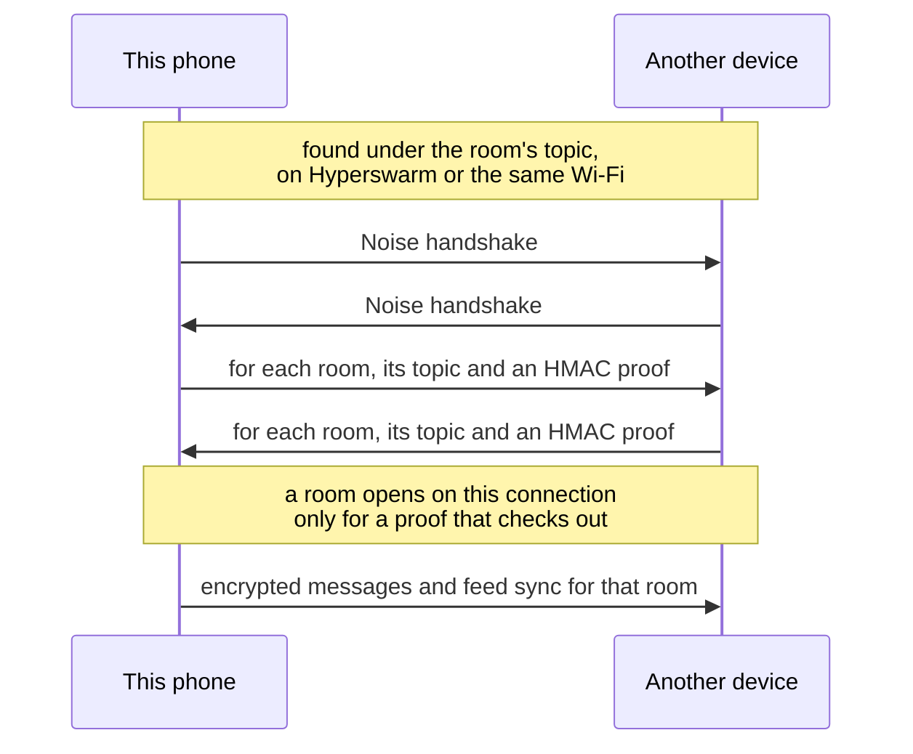

# PeerChat on mobile

PeerChat provides end to end encrypted peer-to-peer group rooms and direct
messages at `peersky://p2p/peerchat/`. There are no accounts and no servers, and
rooms keep working on a local network without internet. The mobile
implementation uses the same room-key, topic, room-proof, message-encryption,
and transport formats as PeerSky Desktop.

## Capabilities

- Create a group or join one with its 64-character room key.
- Exchange encrypted messages with mobile and desktop peers.
- Rooms and direct messages made on 0.1.2 or later change their message key
  every hour, so a key someone gets later cannot read what came before.
- Restore recent rooms and message history after an app restart.
- Reply to messages, add reactions, mention peers, and search chats or messages.
- Share room-encrypted Hyperdrive attachments and bounded HTTP or HTTPS link previews.
- Start direct-message conversations through an explicit accept or decline flow.
- Set a profile and host-owned room name, description, link, image, and moderation.
- Pin or mute rooms and track unread messages and mentions.
- Show online room members and reconnect after temporary network loss.
- Notify for unread messages while the PeerSky process can receive events.

## Architecture

The React Native screen sends bounded commands over the existing `bare-rpc`
bridge. A single `PeerChatService` in the Bare worklet uses PeerSky's shared
`hyper-sdk` runtime for public and local-network discovery. It does not open a
second SDK, Corestore, swarm, local HTTP server, or unrestricted proxy.

Each room derives a discovery topic and an AES-256-GCM message key from separate
contexts. A room made on 0.1.2 or later seals its messages with hourly keys
instead (see [Keys that rotate](#keys-that-rotate)). The room key itself is never used as the public discovery topic, and
it never goes over the wire either: frames name a room by its topic, and a peer
is let into a room on a connection only after it proves it holds the key. Every
received frame, profile field, URL, attachment description, timestamp, and
persisted record is normalized and bounded before use.

Important files:

- `app/peerchat/PeerChatScreen.tsx`: mobile room list, chat UI, and actions.
- `backend/peerchat/service.mjs`: rooms, feeds, synchronization, and lifecycle.
- `backend/peerchat/protocol.mjs`: validation, key derivation, and encryption.
- `backend/peerchat/room-proof.mjs`: the proof a peer gives that it holds a room's key.
- `backend/peerchat/key-chain.mjs`: hourly message keys for rooms made on 0.1.2 or later.
- `backend/peerchat/removal-signature.mjs`: the creator's signature on a room's removal list.
- `backend/peerchat/transport.mjs`: bounded newline-delimited peer frames.
- `backend/peerchat/link-preview.mjs`: bounded public-network preview fetching.
- `backend/peerchat/moderation.mjs`: local content and spam enforcement.
- `backend/peerchat/runtime.mjs`: shared-runtime service initialization and cleanup.

## Moderation

Each phone and desktop filters what it sends and what it receives, on its own.
In a group, a message with threats, slurs or an adult-domain link is held back
and a notice takes its place, and a picture that looks explicit is refused
before it is sent. A direct message skips the text filters: it is between two
people, and either can block the other. The spam limit still applies there, and
a picture that looks explicit arrives hidden behind a warning the reader can
open. Whether a room is a direct message is worked out on each device, never
taken from a peer, so no room setting can switch a group's filters off.

Whoever made a room can remove anyone from it, for good. The creator signs the
room's removal list with their own key, so anyone in the room can pass it on
and every device checks it against the creator's key, which is how a removal
reaches people who never meet the creator. A list from an older build carries
no signature and counts only from the creator's own connection.

## Room-key security

The room key is both an invitation and, in a room made before 0.1.2, the secret
needed to decrypt its messages. Anyone who receives it can join that room and
read synchronized history, all of it in an older room and from the hour they
join in a newer one, so share it only with intended participants. PeerChat currently has no
server-side account, invitation revocation, or mechanism to remove knowledge of
a key from a device that already received it. Create a new room and distribute a
new key if an old key is exposed.

A room's discovery topic is public: DHT nodes see it on the way past, so knowing
it opens nothing. On every connection each side sends, for each of its rooms,
the topic and an HMAC-SHA256 keyed with `SHA-256("peersky-chat:proof:" +
roomKey)` over `"peersky-chat/2 room\n" + handshakeHash + "\n" +
senderPublicKey`, both as hex. The Noise handshake hash is the same at both ends
of one connection and different on every other, and the sender key is the one
that handshake proved, so a proof cannot be replayed elsewhere or bounced back.
A room opens to a peer only when its proof checks out, and this phone sends its
own proofs before anything about a room, so its join never arrives first. Being
found under a room's topic, or naming the room in a frame, counts for nothing.
The desktop makes the same proof, and both pin one test vector.



The chat channel is `peersky-chat/2`. Version 1 sent the room key to anyone who
turned up under a room's topic, so a room used with a version 1 build that has
to stay private is worth recreating. The two versions do not open a channel
with each other.

A direct message's key is the one key that crosses the wire, inside the invite,
to the one person it is for. It goes to their full public key, recorded when the
conversation starts and checked on every answer, never to the 8-character peer
id, which is short enough to grind. A personal link or QR code carries the full
key, so a request from one goes to that key alone. A request started from a
member list, or from an older link with only the 8-character id, goes to the one
connected key with that id, and while two share it, the invite waits.

### Keys that rotate

Rooms and direct messages made on 0.1.2 or later seal each hour's messages with
a different key, so a key someone gets later, from a forwarded invite or a lost
phone, cannot read anything sent before it. The room key marks such a room by
itself: `SHA-256("peersky-chat/3 rotates:" + roomKey)` starts with two zero
bytes, which a new room's key is picked to meet. An older room can never be
given a chain, so it seals with its room key as before and every version reads
it.

- Hours count from the Unix epoch. The chain starts with 32 random bytes, made
  by whoever made the room or opened the direct message, for the hour it was
  made.
- The next hour's secret is `HMAC-SHA256(secret, "peersky-chat/3 next hour")`,
  which cannot be run backwards, and an hour's message key is
  `HMAC-SHA256(secret, "peersky-chat/3 message key")`.
- A message carries its hour as `e`. One without `e` was sealed with the room's
  message key, by an older build or by a device that has no chain yet, and still
  reads.
- On each connection, after a room's details and before its history, a device
  sends `room-chain` with the current hour and its secret, never an earlier one
  and never to someone removed. A phone takes one only when it has none and only
  for an hour from two before its own to one after, keeps it, and passes it on to
  the others in the room. It keeps the earliest secret it was given, so its own
  history stays readable on it.
- A file in such a room is sealed with a `fileKey` of its own, 32 random bytes
  used where the room key would be, and the `fileKey` travels inside the
  encrypted message.
- Link Device carries the chain with each room, and a device keeps the earliest
  start of the same chain.

It protects the past, not the future: every later hour's key follows from any
hour's, so a stolen phone keeps reading new messages until the room is replaced
with a new one. Builds from before 0.1.2 cannot read rooms made on 0.1.2 or
later. The desktop keeps the same rules in peerchat's `lib/key-chain.js`, and
both apps pin one vector (`test/protocol/peerchat-key-chain.test.mjs`).

Messages are encrypted before they are appended to a room feed or sent to a
peer. Sender names, timestamps, reactions, and other routing metadata are not
promised to be anonymous. Peer discovery can also reveal network metadata to
the underlying P2P stack.

Room keys, profile information, recent-room metadata, and local preferences are
stored in the app-private PeerSky data directory, which is kept out of iCloud,
computer and Google backups and out of Android's phone-to-phone copy. The current
mobile build does not protect room keys with Android Keystore or iOS Keychain
hardware-backed encryption, so device access and rooted or jailbroken devices
are part of the local threat model.

## Attachments and link previews

PeerChat stores attachments in a dedicated Hyperdrive for each room. Before
upload, file bytes are sealed with AES-256-GCM using a key derived from the room
key, or in a room made on 0.1.2 or later from a key of the file's own that
travels inside the encrypted message, in the attachment formats PeerSky Desktop
uses too: `PCA1`, in one piece,
up to 100 MB, and `PCA2`, a megabyte frame at a time, for anything bigger.
Both apps read both, and neither ever holds a framed file whole. The real file
name and size travel inside the encrypted chat message.

There is no size limit of PeerChat's own, as in Keet: a file is as big as the
devices at both ends have room for. Sharing keeps a sealed copy on the sender's
phone for the room to download from, and opening one keeps the downloaded
blocks and the opened copy, so the phone checks for that much room first, plus
512 MB to spare, and says how much it needs when there is not enough. Pictures
and videos up to 100 MB load in the chat by themselves on both apps. Anything
bigger waits for a tap, with its size shown, so a huge file never fills a phone
on its own. Room members can
decrypt attachments because they hold the room key, or the message carrying the
file's key; obtaining the `hyper://` URL alone exposes only ciphertext. Legacy plaintext attachments remain readable
for compatibility.

Link previews are optional and run only when the local user sends a public HTTP
or HTTPS URL. Preview fetching rejects credentials, loopback, link-local, and
private-network targets, including names that resolve to one; validates every
redirect; limits redirects and response bytes; and stops after a fixed time
budget. Remote peers cannot use a received message to make this device fetch an
arbitrary preview URL.

## Invite links, blocking and reports

A room or message-request link can come from any web page, so opening one only
asks: joining a room or sending a request shows the people there your name, bio
and photo. Scanning a QR code is already a choice you made, so it goes ahead.

Press and hold a message, or open someone's profile, to report them or block
them. A block hides everything that person sends, in every room, the moment it
is made: their messages, reactions, unread counts, notifications and the chat
list's preview line. It also stops their direct messages and requests, and
takes them out of Find people. What they sent stays on disk, so unblocking
brings it back. Blocking and reporting together is one tap.

A report goes to the maintainers by email. It names the room by the first 16 hex
characters of the SHA-256 of its key, never the key, which would let whoever
reads the email into the room and its whole history. If the phone has no mail
app, the report can be copied instead.

## Notifications

Message notifications require native notification permission and can be
disabled globally or suppressed by muting a room. Sound can be disabled without
disabling the notification itself. On Android, enabling notifications starts a
visible foreground service so the local PeerChat runtime can remain connected
while the app is backgrounded. Android and supported iOS launchers receive the
current unread badge total, and the PeerChat home shortcut shows the same total.
On iOS, background delivery is best effort only: messages can arrive until iOS
suspends PeerSky because PeerChat deliberately has no centralized push server.

## Storage and deletion

PeerChat metadata and writable room feeds live under the shared Hyper storage
directory. PeerChat deliberately does not expose raw room feeds or room keys as
ordinary named Hyperdrives in Settings.

PeerChat settings has **Delete PeerChat profile**. It leaves every room, so each
one hears this device go, then removes the room feeds, the attachment drives,
the decrypted attachment cache and PeerChat's own state file, and PeerChat opens
on the welcome screen again (`deletePeerChatProfile` in
`backend/peerchat/runtime.mjs`). Messages already sent stay on the devices they
reached.

Settings -> P2P Data provides two relevant operations:

- **Clear downloaded P2P cache** closes PeerChat before storage maintenance,
  removes refetchable Hyper cores, retains locally owned room feeds and recent
  room metadata, and then restarts the shared runtime.
- **Clear all P2P data** closes PeerChat and removes its rooms, message history,
  metadata, and the rest of the device's local Hyper data and signing keys.

Leaving one room removes that room from the device and closes its active feed,
without deleting another participant's copy. General browser cache clearing is
separate and does not clear PeerChat or other P2P data.

## Identity transfer

Link Device carries PeerChat between a person's devices: the profile, every
room with its key, a fixed label for the new device (`ada@mobile`,
`ada@desktop1`), and a link the devices use to prove to each other that they
belong to the same person. Each device stays its own member of a room, so
messages reach all of them, and renames and newly joined rooms follow between
them. See [link-device.md](link-device.md).

## Resource limits

The service limits room count, returned and stored history, room and total
storage bytes, frame and message size, pending direct-message requests, peer
members, initial synchronization, queued frames, live/control message rates,
tracked moderation state, and link-preview work. It releases feed listeners,
timers, transports, pending joins, swarm topics, and room state during leave,
runtime reset, P2P clearing, and application shutdown.

These limits protect a mobile process from unbounded memory, storage, and
network use. A room that reaches its local storage limit must be left or cleared
before more messages can be stored.

## Desktop interoperability smoke test

1. Use different profile names on one mobile device and one PeerSky Desktop
   profile.
2. Create a room on mobile, copy its key, join from desktop, and exchange
   messages in both directions.
3. Create another room on desktop, join from mobile, and verify its existing
   history and room details.
4. Verify replies, reactions, mentions, unread state, attachments, direct-message
   requests, pinning, muting, online presence, and host-owned moderation.
5. Disconnect one peer, reconnect it, and confirm history catches up without
   duplicate messages or sessions.
6. Restart both applications and confirm saved rooms and history return.
7. Disable internet access, connect both devices to the same local hotspot, and
   confirm discovery and two-way messaging still work.
8. In a room made on each app, confirm messages and attachments go both ways,
   and that a room made on an older build still works on both.

## Developer checks

Run the deterministic checks before opening or updating a pull request:

```sh
npm run lint
npx tsc --noEmit
npm run test:runtime
npm run bundle:bare
```

PeerChat moderation data is generated from a pinned, licensed upstream source.
See [`backend/peerchat/MODERATION_DATA.md`](../backend/peerchat/MODERATION_DATA.md)
for provenance and regeneration instructions.
