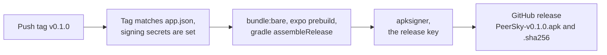

# Releasing to the App Store and Google Play

The code covers what the stores check in the binary. This page is what only a
person can do, in App Store Connect and the Play Console, and what to tell the
reviewers. Go through it once per release.

## Before building

- Run `npx expo prebuild --clean`. An `ios/` or `android/` folder left from an
  older prebuild keeps old settings: the display name, the iPad app icons, the
  backup rules and the removed Android permissions all come from a clean one.
- Build iOS with Xcode 26. Apps built with the iOS 27 SDK must use the UIScene
  life cycle, which this Expo version does not, so stay on Xcode 26 until the
  Expo upgrade that brings it. On EAS, pin an Xcode 26 image.
- Bump `version` in `app.json` for a new store version. EAS increments build
  numbers.

## App Store Connect

- **Multicast entitlement.** `com.apple.developer.networking.multicast` is in
  `app.json` for finding PeerSky devices on the same Wi-Fi. Apple has to grant
  it to the team first ([request it here](https://developer.apple.com/contact/request/networking-multicast)),
  or signing fails.
- **App Group and the widgets.** The home screen widgets (`targets/widgets`)
  are their own target, `xyz.p2plabs.peersky.widgets`, and read what the app
  leaves for them in the App Group `group.xyz.p2plabs.peersky`. Both bundle IDs
  need the App Groups capability with that group, under team `PP6D6HB667`
  (`ios.appleTeamId` in `app.json`). A build that lets Xcode change
  provisioning registers them: from Xcode, or with `-allowProvisioningUpdates`
  (the command is in the README). `npx expo run:ios` does not, because Expo
  only allows that when it picks the team itself. Or add them in the developer
  portal. The widgets need iOS 17.
- **App Privacy.** Data Not Collected. There are no analytics, no accounts and
  no servers. Peers see each other's IP address because devices connect
  directly; that is not collection by us.
- **Export compliance.** `ITSAppUsesNonExemptEncryption` is `true`. PeerSky
  uses standard encryption (Noise and libsodium for connections, AES-GCM for
  attachments, Argon2id for backup passphrases) and no proprietary algorithms.
  Answer the questions that way, and file whatever your country requires for
  mass-market encryption.
- **Age rating.** Unrestricted web access and user-generated content (PeerChat)
  both get answered yes, which puts PeerSky in the top age band. PeerChat's own
  rules say 16 and over.
- **URLs.** Privacy policy: `PRIVACY.md` on GitHub. Support: the repository, or
  contact@p2plabs.xyz.

## Notes for the App Review team

Paste something like this into App Review Information:

> PeerSky is a web and peer-to-peer browser. There is no sign-in. PeerChat (the
> chat icon on the home screen) connects devices directly, with no server.
> A new PeerChat profile joins P2P Republic, a public room, so you can see other
> people's messages without a second device.
>
> User-generated content safeguards (Guideline 1.2): before chatting, people
> agree to the rules and terms of use, which have no tolerance for objectionable
> content or abusive users. Messages are filtered for abuse, slurs and adult
> links, and nude pictures are refused on the device. Press and hold any message
> to Report it or Block its sender; a block hides everything that person sends,
> at once, everywhere. Reports reach contact@p2plabs.xyz and are read within 24
> hours, and we remove abusive people from P2P Republic. PeerChat settings has
> Delete PeerChat profile.

Someone has to read contact@p2plabs.xyz every day. That 24 hour promise is in
the app and in `TERMS.md`.

## Google Play Console

- **Foreground service.** The app declares `FOREGROUND_SERVICE_REMOTE_MESSAGING`
  for PeerChat's background service. Declare it under App content, Foreground
  service permissions, as messaging, with a short video: notifications on in
  PeerChat, the app in the background, a message arriving, and the ongoing
  notification. Nothing else declares a foreground service type: the media
  playback one is blocked, because PeerTunes plays through its WebView.
- **Data safety.** We collect and share nothing ourselves, but the QR scanner
  on Android is Google's ML Kit (through expo-camera), and ML Kit sends Google
  its own diagnostics: device model and OS version, the app's package and
  version, a per-installation identifier, latency and error codes. Google says
  it is encrypted in transit and not passed on
  ([ML Kit data disclosure](https://developers.google.com/ml-kit/android-data-disclosure)).
  Declare it as collected, not shared, for analytics: App info and performance
  (Diagnostics) and Device or other IDs. The iOS app has no ML Kit, so App
  Privacy stays Data Not Collected. People can delete their data
  in the app (Delete PeerChat profile, and Settings, P2P Data, Clear all P2P
  data).
- **Child safety standards.** Social apps have to publish them. Point to
  `TERMS.md` (PeerChat rules) and the Children section of `PRIVACY.md`, with
  contact@p2plabs.xyz as the point of contact.
- **Content rating.** Answer yes to users interacting, user-generated content
  and unrestricted internet access.
- **Target API and page size.** Expo builds target API 36, and
  `plugins/with-android-16kb-libs.js` keeps native libraries 16 KB aligned.
- **Sensitive permissions.** None that need a declaration form. Camera,
  microphone and location are asked for only when a website or a QR scan needs
  them. `REQUEST_INSTALL_PACKAGES`, storage access, overlays and the media
  playback service are blocked in `app.json`.

## APK on GitHub releases

`.github/workflows/release-apk.yml` builds the Android app when a `v*` tag is
pushed (or a release is made with a new tag on GitHub), signs it, and attaches
`PeerSky-<tag>.apk` (64-bit ARM, which every recent phone is) and its SHA-256
to the release. The tag has to match
`version` in `app.json`, so `v0.1.0` for 0.1.0, or the run stops.



Phones only install an update signed with the same key as the copy they have,
so the key is made once and kept:

```bash
keytool -genkeypair -v -keystore peersky-release.keystore -alias peersky -keyalg RSA -keysize 4096 -validity 10000
```

Add four repository secrets: `ANDROID_KEYSTORE_BASE64` (the output of
`base64 -i peersky-release.keystore`), `ANDROID_KEYSTORE_PASSWORD`,
`ANDROID_KEY_ALIAS` (`peersky` above) and `ANDROID_KEY_PASSWORD`. Without them
the run stops before building. Back the keystore up somewhere safe: losing it
means every APK user has to uninstall to move to the next one.

Google Play re-signs with its own key, so a phone cannot switch between the
Play copy and the GitHub APK without uninstalling first.

## After review

- Answer reports within 24 hours, and remove people from P2P Republic from the
  device that runs it when they break the rules.
- Keep `PRIVACY.md` and `TERMS.md` in step with what the app does. The app links
  to both on GitHub.
